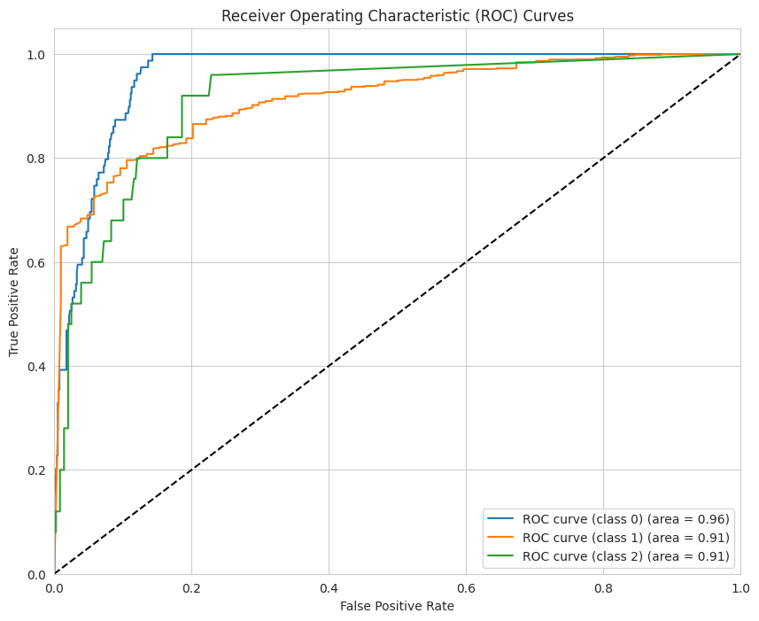
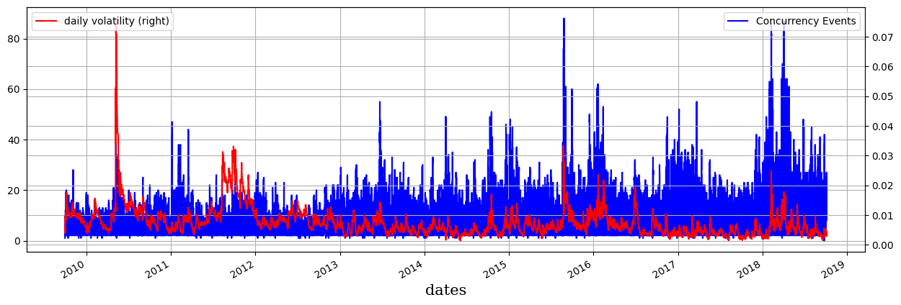

# Application of Statistical Bootstrapping in Financial Machine Learning 

 

 

 

## Project Overview
The objective of this project was to employ techniques against unstructured financial time-series data 
by applying approaches in mathematical and statistical modeling thereby improving key properties necessary 
for robust and reliable models.  This project implements a few of the concepts covered by Marcos López de Prado’s 
textbook Advances in Financial Machine Learning including ideal financial data structures for improved 
statistical properties, differentiation, data labeling and sampling, sequential bootstrapping, and bagging 
machine learning models.  

## Project Methodology

In this project I employ these techniques to create an ETL pipeline to a random forest model for E-mini S&P 500 futures 
minute data from 2009 to 2018 according to classifications determined by the triple-barrier method.  

## Project Paper
Here is a link to my project paper covering an overview of the project background, methods, and results:
[[https://github.com/jameshopham/Graph-RAG-LLM-Research-Consultant/blob/main/Graph%20Rag%20Project%20Write-Up.pdf](https://github.com/jameshopham/Financial-ML-Bagging/blob/main/Project%20Write-Up.pdf)]

### Built With

This project was built with the following technologies:

- Python
- pandas
- numpy
- matplotlib
- seaborn
- scikit-learn

## Reference
Here is the textbook referenced for this project:

Advances in Financial Machine Learning by Marcos Lopez de Prado

## Contact

If you have any questions or suggestions, feel free to reach out to me:

- Connect with me on LinkedIn:

    
     
    <a href="https://www.linkedin.com/in/james-hopham-2440352a5/" target="_blank">James Hopham</a>

